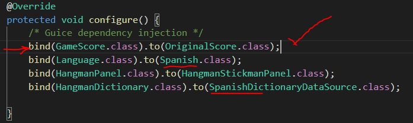
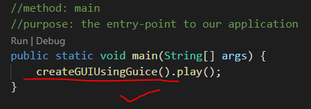
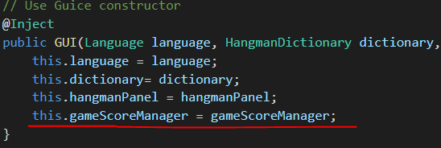

### Escuela Colombiana de Ingeniería

### Ciclos de vida y desarrollo de Software

### Parte I

Pruebas de equivalencia implementadas

### Parte II

Lo primero que hacemos es incluir el OriginalScore a la configuracion

 
Luego modificamos el main, creando por GUICE y no por Factory

Configuramos la aplicación de manera que desde el programa SwingProject
  NO SE CONSTRUYA el Score directamente, sino a través de Guice, asi
  mismo como las otras dependencias que se están inyectando mediante
  la fabrica.

Lo configuramos con el OriginalScore y con el idioma Frances